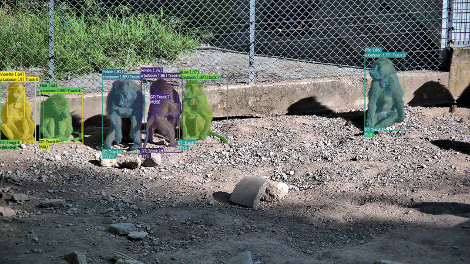

# BaboonTrack: An Open-Source Pipeline for Automated Detection, Tracking and Individual Identification of Baboons and more

<p align="center">
  
</p>

> 🚧 **Work in progress.** BaboonTrack is under active development. APIs, models and output formats may change between releases.


This package provides an end-to-end pipeline for **detecting, tracking and identifying individual baboons** in videos. It is designed to facilitate behavioural and ecological studies by automatically processing long video sequences and producing detection, tracking and identity predictions together with evaluation metrics.

## Description

BaboonTrack is an open-source Python package for automated analysis of baboon videos. It combines modern computer vision models into a unified pipeline capable of:

- 🦍 Detecting baboons in images and videos.
- 🎯 Tracking individuals across frames.
- 👤 Identifying known individuals from facial appearance.
- 📊 Evaluating detection, tracking and identification performance using standard metrics (COCO, MOTChallenge and identity classification).

The package is designed to be modular, allowing different detectors, trackers and classifiers to be easily compared. It can be used either as:

- a Python library:
  ```python
  import baboontrack
  baboontrack.run(input_video="video.mp4")
  ```

- or from the command line:
  ```bash
  baboontrack -i video.mp4
  ```

Although the project currently focuses on baboons, most components are generic and can be adapted to other species with appropriate models, prompts and training data.

## Dependencies

This package highly depends on [MegaDetector](https://megadetector.readthedocs.io/en/latest/index.html) which requires Python <3.14, >=3.9. Make sure to have the proper [python version](https://www.python.org/downloads/) installed before going to the next steps. You may replace the next commands `python` by `py -3.13` (for python 3.13) on Windows or `python3` or `python3.13` (when several python 3 are installed) for Linux and MacOS. 

<!-- **Side note:** The use of `pyenv` tool or similar to separate your python versions may not support the graphical user interface. -->

## Installation

If you downloaded this repository, make sure you to enter the following commands at the level of the package folder.

```
cd baboontrack
```

### Virtual environment (good practice)

Create a virtual environment. In this example the virtual environment will be stored in the hidden folder `.venv`.

```
python -m venv .venv
```

#### venv activation
**Linux and MacOS:**
```
source .venv/bin/activate
```
**Windows:**
```
.\.venv\Scripts\activate
```

### Package installation

This is a local wheel file proper to this repository. It is not yet published, hence publicly available, on pip.

**Linux and MacOS:**
```
pip install dist/baboontrack-0.0.1-py3-none-any.whl
```
**Windows:**
```
pip install .\dist\baboontrack-0.0.1-py3-none-any.whl
```

### SAM3

SAM 3 can be used for both detection/segmentation and tracking, and is more flexible than traditional detection approaches, since it can operate from simple prompts to identify and segment objects.

However, SAM 3 and OpenMM rely on different PyTorch versions and therefore do not coexist easily within the same environment. We recommend following the official installation instructions provided here:

[https://github.com/facebookresearch/sam3](https://github.com/facebookresearch/sam3)

Our implementation uses the dedicated Conda environment called `sam3` created via their instruction, to launch our SAM3-based implementation to process chunks of videos and ensure compatibility with the rest of the pipeline.

Furthermore, SAM3 model requires ~5 GB of GPU memory in addition to runtime memory for image processing. On GPUs with less than ~10 GB VRAM, CUDA execution may become impossible.

#### Memory estimate (approx.)

```text
total_memory ≈ 5 GB + (num_pixels / 100,000,000) × chunk_size
```

#### Chunk size estimation

```text
chunk_size ≈ (available_memory_GB − 5) × 100,000,000 / num_pixels
```

#### Examples

* ~200 MP image → ~15 GB + 5 GB ≈ 20 GB total
* ~50 MP image → ~3.75 GB + 5 GB ≈ 8.75 GB total

### OpenMMLab (required for PrimateFace)

PrimateFace relies on OpenMMLab ecosystem (MMCV, MMDetection, MMPose), which requires a compatible PyTorch + CUDA setup.
They have to be installed separately and we provided a script for this purpose, which may have to be adapted according to your setup.

**Linux and MacOS:**
```
bash scripts/install_openmmlab.sh
```
**Windows (when bash available):**
```
bash scripts\install_openmmlab.sh
```
**Or manually:**
```
pip install torch==2.1.0 torchvision --index-url https://download.pytorch.org/whl/cu121
pip install -U openmim
mim install "mmcv>=2.0.0rc4, <2.2.0"
mim install mmdet
mim install mmpose
pip install "numpy<2.0"
```

### ffmpeg (facultative)

You may [download ffmpeg](https://ffmpeg.org/download.html) for your distribution in order to create video outputs. 

## Running baboontrack

### From the terminal

```
baboontrack -i input_video.mp4
```

For more information on possible options:

```
baboontrack -h
```

### In python

``` python
import baboontrack
baboontrack.run(input_video="input_video.mp4")
# More information on possible options
baboontrack.run(help=True)
```

### Your own local version

If you wish to modify your own local version and run it:

```
python -m src.baboontrack.cli -i input_video.mp4
```

## Update baboontrack

This package is not published yet and may be updated. Github actions have been set to update the '.whl' file automatically. In order to retrieve the last updates, first pull the latest version of the repository and then reinstall the the '.whl' file. Make sure to be in your virtual environment.

```
git pull
```

**Linux and MacOS:**
```
source .venv/bin/activate
pip install dist/baboontrack-0.0.1-py3-none-any.whl --force-reinstall
```

**Windows:**
```
.\.venv\Scripts\activate
pip install .\dist\baboontrack-0.0.1-py3-none-any.whl --force-reinstall
```

## Documentation

Doc is built automatically from source code. It is deployed on `gh-pages` branch.
Link: https://ccp-eva.github.io/baboontrack/

Once this repository published, the documentation will need to be published too (Settings -> Pages).
Doc is also available in the `docs` folder of this repository.

## Citation

If you use this program, please cite this work:

WORK IN PROGRESS - contact the repo owner.